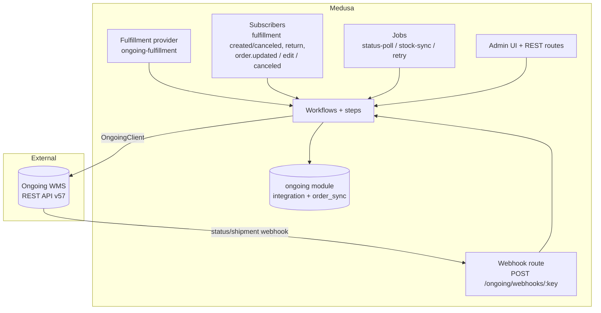
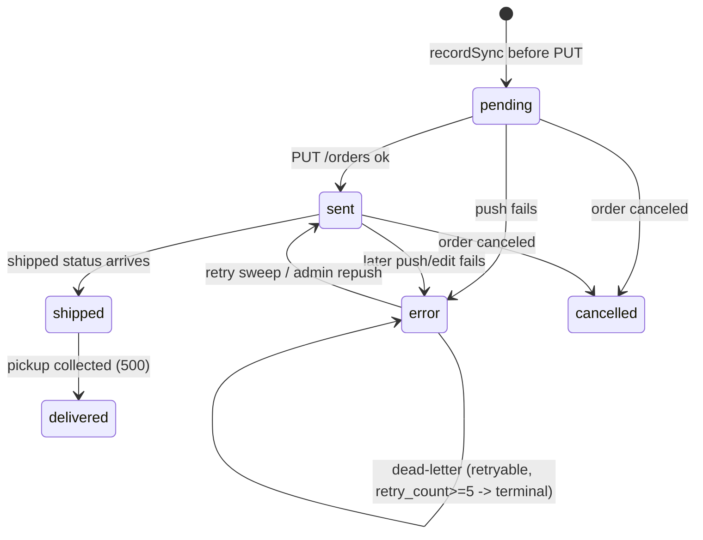

This page explains how the Ongoing Warehouse plugin is built: its module and data models, the Ongoing REST client stack, the workflows and steps that drive every mutation, the subscribers, jobs, links, API routes, fulfillment provider, and admin UI — and how those pieces cooperate across the order, shipment, inventory, edit, cancellation, and retry lifecycles. Read it before changing runtime behaviour. For per-option reference, see the User pages; for the rules you must follow when editing this code, see [[Dev Medusa Rules]].

## Runtime picture at a glance

The plugin fulfils Medusa orders through Ongoing and syncs stock back. Ongoing is the system of record for warehouse stock and shipping; Medusa pushes orders and pulls back fulfilment, tracking, and inventory levels.



Every order-path mutation goes through a workflow; workflows own the Ongoing API calls and the sync-state writes. The module persists integration config and a per-fulfilment sync-state ledger.

## The `ongoing` module

Source: [`src/modules/ongoing/`](https://github.com/Comfyballs/MedusaOngoingWarehousePlugin/blob/main/src/modules/ongoing). Module name `ongoing` (`ONGOING_MODULE`), exported via `Module(ONGOING_MODULE, { service: OngoingModuleService, loaders: [validateOptionsLoader] })`. The service extends `MedusaService({ OngoingIntegration, OngoingOrderSync })`, so standard CRUD (`listOngoingIntegrations`, `updateOngoingOrderSyncs`, and so on) is generated automatically.

### Data model: OngoingIntegration

Table `ongoing_integration`. One row per warehouse integration: one Ongoing goods owner bound to one Medusa stock location.

| Field | Type | Meaning |
|---|---|---|
| `credential_key` | text, unique | Key into the plugin-options `integrations` array. Credentials themselves never live in the DB. |
| `enabled` | boolean | Master switch; disabled integrations are skipped by jobs and by `getIntegrationByLocation`. |
| `stock_location_id` | text, unique | The Medusa stock location this warehouse serves. Immutable after creation. |
| `stock_sync_enabled` | boolean | Gates the stock-sync job for this integration. |
| `stock_sync_interval` / `status_poll_interval` | text, nullable | Per-integration intervals in ms; null falls back to the plugin-option defaults (600000 / 60000). |
| `stock_reconcile_mode` | enum | `sellable_plus_reserved` (default), `precise`, or `onhand`. Controls how Ongoing quantities map to Medusa `stocked_quantity`. |
| `edit_sync_rules` | json, nullable | Per-category rules gating which order edits may re-push at which Ongoing status codes. |
| `shipped_status_codes` | json, nullable | Ongoing status codes treated as "shipped". |
| `cancellable_status_codes` | json, nullable | Ongoing status codes at which a cancel toward Ongoing is allowed. |
| `last_stock_delta_cursor` | text, nullable | ISO timestamp passed as `stockInfoChangedFrom` next tick; advanced only on success; null forces a full sweep. |
| `last_full_stock_sync_at` | dateTime, nullable | Drives the 6-hour full-reconciliation fallback so missed deltas self-heal. |
| `sync_lock_until` | dateTime, nullable | Advisory lock TTL for the status-poll job. |
| `stock_sync_lock_until` | dateTime, nullable | Advisory lock TTL for the stock-sync job — independent of `sync_lock_until` so the two jobs never block each other (bead `mjy`). |
| `created_fulfillment_set_id` | text, nullable | Fulfillment set `setupOngoingLocationWorkflow` **created**; null when the set was reused (pre-existing/shared). Read by the guarded `cleanup-ongoing-location` workflow so it targets exactly our artifacts (bead `pud` slice a). |
| `created_service_zone_id` | text, nullable | Service zone created by setup; consumed by `cleanup-ongoing-location`. |
| `created_shipping_option_ids` | json, nullable | Shipping option ids created by setup (string array); consumed by `cleanup-ongoing-location`. |

Bookkeeping columns (`last_stock_sync_at`, `last_status_poll_at`) record the last tick.

The `created_*` columns are populated by setup but not yet consumed: integration delete still leaves these artifacts behind (the known accepted gap the admin delete prompt warns about). They exist so a future opt-in cleanup workflow (bead `pud` slices b/c, deferred pending product sign-off) can delete exactly what setup created — never a reused/shared set.

### Data model: OngoingOrderSync

Table `ongoing_order_sync`. One row per `(order, fulfillment)` pushed to Ongoing — the sync-state ledger.

Key fields: `ongoing_order_number` (unique, deterministic idempotency key `<display_id>-<fulfillment_id>`, persisted before the PUT so a crash never orphans an Ongoing order), `ongoing_order_id` (Ongoing's internal id, returned by `PUT /orders`), `sync_state`, `error_class`, `retry_count`, `shipped_at` (shipment idempotency marker), `delivered_at` (pickup-collection idempotency marker for the `shipped` → `delivered` two-step, bead `18m`), and the `edit_blocked_*` trio (when and why an order edit was blocked from re-syncing).

`integration_id` is a plain text column (FK by convention, no relationship).

### Sync-state machine



`shipped` is **not** terminal: a pickup order still advances `shipped` (450) → `delivered` (500). Only `delivered` and `cancelled` end the lifecycle for polling/refresh (`TERMINAL_SYNC_STATES`, bead `18m`).

The `error_class` (`retryable` | `terminal`) decides whether the retry job touches a row. Rows stuck in `pending` whose workflow died are flagged back to `error(retryable)` by the orphan-repair workflow so the normal sweep picks them up.

### Service methods worth knowing

- `getClient(credentialKey)` returns a **cached** `OngoingClient` per credential key — one client means one `Throttle` governs all process-wide concurrency toward a goods owner.
- `getCredentials(credentialKey)` is a synchronous in-memory lookup into plugin options (deliberately sync, with an eslint-disable).
- `getIntegrationByLocation(stockLocationId)` returns the first **enabled** integration for a location.
- `recordSync(input)` upserts an `OngoingOrderSync` row keyed on `ongoing_order_number`.
- `acquireSyncLock(integrationId, ttlMs, lockName?)` / `releaseSyncLock(integrationId, lockName?)` implement the advisory lock. `lockName` is `"status_poll"` (default, `sync_lock_until` column) or `"stock_sync"` (`stock_sync_lock_until` column) — independent per job so status-poll and stock-sync never block each other. Acquisition is a **CAS-guarded native UPDATE** (`UPDATE ... WHERE id=? AND <column>=<observed value>`), the same pattern as `attemptRetrySyncTransition`, so two instances can't both win the same lock (bead `mjy`).
- `attemptRetrySyncTransition(input)` is a **CAS-guarded native UPDATE** (`UPDATE ... WHERE id=? AND sync_state='error' AND retry_count=<expected>`) that returns true only if exactly one row changed. It deliberately bypasses last-write-wins CRUD so two ticks can't double-retry a row.

### Plugin options and boot validation

`OngoingPluginOptions`: `integrations: OngoingCredentials[]` (each `{ key, baseUrl, username, password, goodsOwnerId, webhookSecret? }`), plus optional `defaultStockSyncInterval`, `defaultStatusPollInterval`, and `rateLimitConcurrency` (Throttle concurrency per goods owner, default 1). The `validate-options` loader runs the same validation at module boot and logs the validated integration count, so misconfiguration fails app startup rather than first use.

### Migrations

Several migrations under [`src/modules/ongoing/migrations/`](https://github.com/Comfyballs/MedusaOngoingWarehousePlugin/blob/main/src/modules/ongoing/migrations): the base tables and indexes, the `edit_blocked_*` columns, the delta-stock-sync columns, the `stock_sync_lock_until` column (bead `mjy`), the `cancel_refused_*` and `sync_kind` columns, and the `created_*` setup-artifact columns (bead `pud` slice a). See [[Dev Gotchas]] for the `plugin:db:generate` recipe when you change a model.

## Ongoing REST client stack

Source: [`src/lib/ongoing/`](https://github.com/Comfyballs/MedusaOngoingWarehousePlugin/blob/main/src/lib/ongoing). The barrel `index.ts` re-exports a curated surface (`OngoingClient`, error helpers, `Throttle`, `mapOrderToPostOrderModel`, `mapReturnOrderToPostReturnOrderModel`, `resolveArticleNumber`, `buildOngoingOrderNumber`, `buildOngoingReturnOrderNumber`, retry policy, `ONGOING_EVENTS`, and the types). Internal-only modules (`http-transport`, `way-of-delivery`, `ensure-articles`, `order-change-burst`, `re-query-fulfillment-order`, `re-query-return-fulfillment`, `schemas`, `db-errors`, `emit-domain-event`) are imported by relative path.

### OngoingClient

- **Auth**: HTTP Basic, header computed once in the constructor from `username:password`.
- **Options**: `concurrency` (default 1), `maxRetries` (default 3), `timeoutMs` (default 30000), an injectable `fetchImpl` (default `nodeHttpsFetch`), and an injectable `sleep` for tests.
- **Request pipeline**: `request<T>` wraps each attempt in `throttle.run(...)`; on failure, `classifyError` decides retryable (`classifyHttpStatus` treats **408**, 429, and 5xx as retryable), backoff uses the `Retry-After` header when present — both the delta-seconds and the RFC 7231 HTTP-date forms — else `250 * 2^attempt` ms, and terminal or exhausted attempts rethrow. `doFetch` sets an `AbortController` timeout, turns non-2xx into `OngoingApiError`, and treats a 2xx without JSON content-type (or with unparseable JSON) as a **terminal** `unexpected_body_shape` error — this guards against HTML-on-200 WAF proxies.
- **Methods**: `getOrderStatuses`, `getInventory(articleNumbers?, changedSince?)`, `getOrdersByStatus(from, to)`, `putArticle`, `putOrder` (throws a **retryable** error if a 2xx body lacks a numeric `orderId`; its `PostOrderResponse { orderId, message }` are both typed nullable per openapi v57, mirroring `putReturnOrder` — bead `5u8`), `cancelOrder`, `getOrder(ongoingOrderId)` (`GET /orders/{id}`, used to resolve a return order line's `orderLineId`), and `putReturnOrder` (`PUT /returnOrders`, throws **retryable** if a 2xx body lacks a numeric `returnOrderId` — mirrors `putOrder`'s guard). There is no `testConnection` method — the `POST /admin/ongoing/test-connection` route and the live smoke test both call `getOrderStatuses()` directly (bead `8jj`).
- **Pagination**: private `paginateByCursor` implements ID-cursor pagination per the Ongoing spec (page size 50, stop on empty/short page, `maxId+1` cursor, infinite-loop guard).

### Transport: why node http/https, not fetch

Source: [`http-transport.ts`](https://github.com/Comfyballs/MedusaOngoingWarehousePlugin/blob/main/src/lib/ongoing/http-transport.ts). Ongoing's API (IIS plus a WAF) returns a `500 {"Message":"An error has occurred."}` on **every** call made through Node's global `fetch` (undici high-level), while curl, node `https`, and undici low-level `request()` all succeed with identical headers — verified live (bead `9sp`, commit `4965f28`). `nodeHttpsFetch` is a `typeof fetch`-compatible adapter over `http`/`https.request`: it sets explicit `content-length` (no chunked PUT), forwards `init.signal` so the client's abort-timeout works, flattens array headers, and maps zero-length bodies to `null` for 204/205/304. Timeout handling stays entirely in the client.

### Throttle

Source: [`throttle.ts`](https://github.com/Comfyballs/MedusaOngoingWarehousePlugin/blob/main/src/lib/ongoing/throttle.ts). A counting semaphore with a FIFO wait queue. Per-credential-key scoping happens one layer up in `getClient`, which caches one client — and therefore one throttle — per credential key. This matches Ongoing's guidance to serialize calls per goods owner (see the [parallel-requests](https://developer.ongoingwarehouse.com/parallel-requests) note).

### Error taxonomy

Source: [`errors.ts`](https://github.com/Comfyballs/MedusaOngoingWarehousePlugin/blob/main/src/lib/ongoing/errors.ts). One class, `OngoingApiError`, carries `status`, `kind` (`retryable` | `terminal`), `retryAfterMs`, `body`, and `reason`. Classification:

- `classifyHttpStatus`: 429 or >=500 is retryable; other 4xx is terminal.
- `classifyError`: an `OngoingApiError` keeps its own kind; **anything else is retryable** (network errors — ECONNRESET, DNS, timeout, abort — are deliberately retryable).
- Domain throws from the order mapper and article resolver are always **terminal** (they are data-quality problems).
- Schema and content-type failures are terminal `unexpected_body_shape`; the one exception is a 2xx PUT without an `orderId`, which is retryable.

### Two retry layers

Do not confuse them. The **client** retries a single HTTP call (base 250 ms). The **workflow** retry policy ([`retry-policy.ts`](https://github.com/Comfyballs/MedusaOngoingWarehousePlugin/blob/main/src/lib/ongoing/retry-policy.ts)) counts separate driver passes over a persisted sync row: `MAX_SYNC_RETRIES = 5`, backoff `min(60min, 5min * 2^retry_count)` (5, 10, 20, 40, 60 min) plus an additive random jitter of up to +20% (`RETRY_JITTER_RATIO`) so a shared Ongoing outage doesn't make many rows re-sweep in lockstep. `resolveRetryOutcome` is pure: terminal rows stay dead-lettered; otherwise increment the count and flip to terminal once the cap is reached.

### Order mapping and article resolution

- [`order-mapper.ts`](https://github.com/Comfyballs/MedusaOngoingWarehousePlugin/blob/main/src/lib/ongoing/order-mapper.ts): `mapOrderToPostOrderModel` is pure and every failure throws a **terminal** `OngoingApiError`. It builds `orderNumber`, `deliveryDate` (required, no default), `consignee` from the shipping address, and `orderLines`. When a line carries `unit_price` it is mapped **as-is — no ×100**, per Medusa's price rule (see [[Dev Medusa Rules]]). `weight`/`unit_price` are resolved by [`query-fulfillment-order.ts`](https://github.com/Comfyballs/MedusaOngoingWarehousePlugin/blob/main/src/workflows/steps/query-fulfillment-order.ts) (bead `dl3`): `re-query-fulfillment-order.ts` fetches `order.items.unit_price` (same-module, Order) and `order.items.variant.weight` (cross-module join into Product), keyed by order line item id; `query-fulfillment-order.ts` matches each fulfillment item back to its order line via `line_item_id` and attaches `weight`/`unit_price` to `ResolvedLine`, falling back to `null` when a line has no match. Per-line `currency_code` is intentionally left unset — the mapper falls back to the order-level `currency_code`.
- [`ensure-articles.ts`](https://github.com/Comfyballs/MedusaOngoingWarehousePlugin/blob/main/src/lib/ongoing/ensure-articles.ts): `ensureArticlesExist` is Ongoing webshop-flow step 1 — it upserts each unique articleNumber via `putArticle` **sequentially**, and runs before every order PUT (push and edit).
- [`resolve-article-number.ts`](https://github.com/Comfyballs/MedusaOngoingWarehousePlugin/blob/main/src/lib/ongoing/resolve-article-number.ts): the Ongoing articleNumber **is** the Medusa SKU verbatim. The function only validates uniqueness by querying `product_variant` by SKU (0 or >1 matches is terminal).

### Return order mapping

- [`return-order-mapper.ts`](https://github.com/Comfyballs/MedusaOngoingWarehousePlugin/blob/main/src/lib/ongoing/return-order-mapper.ts): `mapReturnOrderToPostReturnOrderModel` is pure and every failure throws a **terminal** `OngoingApiError`, mirroring `order-mapper.ts`. It builds `returnOrderNumber`, `customerOrder.orderId` (the ORIGINAL Ongoing order id), `inDate` (date-only, e.g. `"2026-07-17"` — **not** a full ISO datetime like `PostOrderModel.deliveryDate`), and `returnOrderLines`. Each return line's `customerOrderLine.orderLineId` is resolved by matching the return line's articleNumber against the original order's Ongoing order lines (fetched via `OngoingClient.getOrder`); each original line is consumed at most once so duplicate article numbers on the original order map to distinct lines.
- The `PostReturnOrderModel` shape (`goodsOwnerId`, `returnOrderNumber`, `customerOrder.orderId`, `inDate`, `comment?`, `returnOrderLines[]`) is confirmed against the official [Ongoing REST API Example Requests](https://github.com/OngoingWarehouse/Ongoing-Warehouse-REST-API-Example-Requests) Postman collection ("Return orders" > "Create or update a return order"). The `PUT /returnOrders` response shape — `PostReturnOrderResponse { returnOrderId: int32 nullable, message: string nullable }` — is confirmed against the official `openapi.json` (version 57): the id field name (`returnOrderId`, originally inferred by analogy with `putOrder`'s `orderId`) is correct, and both fields are nullable, which `OngoingClient.putReturnOrder`'s `typeof res?.returnOrderId !== "number"` guard already tolerates (bead `2a6`). Not yet exercised against a live Ongoing sandbox (see [[Dev Testing]] `test:live`).

### Way-of-delivery and order-change burst

- [`way-of-delivery.ts`](https://github.com/Comfyballs/MedusaOngoingWarehousePlugin/blob/main/src/lib/ongoing/way-of-delivery.ts) has two validators over `shipping_option.data`: a lenient `extractOngoingCarrier` (runtime, never throws — malformed config just yields no carrier) and a strict `assertValidOngoingCarrierConfig` (config-time, throws `MedusaError`). The asymmetry is intentional: fail at config save, never fail an order push.
- [`order-change-burst.ts`](https://github.com/Comfyballs/MedusaOngoingWarehousePlugin/blob/main/src/lib/ongoing/order-change-burst.ts): Medusa's `updateOrderWorkflow` inserts one `order_change` row per changed field. A naive `take:1` subscriber query would silently drop sibling changes, so `deriveBurstChangedTypes` unions all changed types across rows within a 2-second window of the newest row. The `ADDRESS_CONTACT_DETAIL_TYPES` set (`shipping_address` / `billing_address` / `email`) is verified against Medusa 2.16.0's `updateOrderWorkflow` source; a spurious `"contact"` entry that matched no real detail type was removed.

### Status semantics

- [`status-semantics.ts`](https://github.com/Comfyballs/MedusaOngoingWarehousePlugin/blob/main/src/lib/ongoing/status-semantics.ts) (bead `18m`): the single source of truth for interpreting Ongoing's numeric order statuses. `CANONICAL_ONGOING_STATUS_STAGES` maps each documented code to a stage (`created`/`picking`/`picked`/`shipped`/`delivered`/`returned`/`cancelled`); `CANONICAL_SHIPPED_STATUS_CODES` (425/450/451) and `CANONICAL_DELIVERED_STATUS_CODES` (500) are **derived** from that map so they can't drift. `resolveShipmentStage(code, { shippedCodes, deliveredCodes })` is the behaviour-driving function the poll job and webhook receiver call: it returns `shipped | delivered | other`, prefers the operator's per-integration lists when non-empty, falls back to the canonical defaults otherwise, and checks `delivered` **before** `shipped` so a `500` on a pickup order can't collapse back into a plain shipment. This is why `picked` (400) is deliberately *not* `shipped`, and why the `shipped` (450) → `delivered` (500) pickup two-step is a real transition rather than a swallowed one.

## Workflows and steps

Source: [`src/workflows/`](https://github.com/Comfyballs/MedusaOngoingWarehousePlugin/blob/main/src/workflows). All order-path mutations go through workflows. Several steps deliberately use **record-then-rethrow** instead of compensation: a throwing invoke hands compensation `undefined`, and the Ongoing PUT is an idempotent upsert keyed on a persisted order number, so forward-recovery/retry is the model, not rollback.

| Workflow | Trigger | What it does |
|---|---|---|
| `push-order-to-ongoing` | `order.fulfillment_created` subscriber (async), admin repush, retry job | Query fulfilment+order, resolve SKUs to articleNumbers, map to `PostOrderModel`, `recordSync(pending)` before PUT, `ensureArticlesExist`, `putOrder`, then `sent`/`error`. No compensation. **Cancel/push race guard (bead `x5n`):** immediately before `putOrder` the step re-checks `canceled_at` on the order **and** the fulfilment; if either is set, it creates no Ongoing order, records the row `cancelled`, and aborts — so a cancel that lands during the `pending` push window (which `decide-ongoing-cancel` would skip as `no_ongoing_order_id`) can't leave a live un-cancelled order. A `sent`-path retry converges the same way. |
| `push-return-order-to-ongoing` | `order.return_requested` / `order.exchange_created` / `order.claim_created` subscribers (async) | Query the return fulfillment (no `order` relation), resolve the ORIGINAL order + its sent/shipped `OngoingOrderSync` row from one item's `line_item_id`, fetch that order's Ongoing lines (`getOrder`) to resolve `orderLineId` per articleNumber, map to `PostReturnOrderModel`, `putReturnOrder`. Records an `OngoingOrderSync` row with `sync_kind="return"` (bead `8p8`): `pending` before the PUT, `error`/`sent` after — so a failed return push lands an `error`/`retryable` row that the `retry-failed-syncs` job re-pushes (via the return workflow) with the same backoff/dead-letter semantics as an order push. Also emits `ONGOING_EVENTS.RETURN_ORDER_PUSHED` / `RETURN_ORDER_PUSH_FAILED`. |
| `sync-order-edit-to-ongoing` | edit subscribers | Gate the edit against `edit_sync_rules`, then re-query and re-PUT the **same** order number. Re-gates internally to close a TOCTOU race. |
| `cancel-ongoing-order` | `order.canceled` + `order.fulfillment_canceled` subscribers | Decide against `cancellable_status_codes`, DELETE toward Ongoing (swallowing "already cancelled"), then mark the row `cancelled`. **Ledger-write recovery (bead `98q`):** if the DELETE succeeds but the `mark-order-sync-cancelled` write then throws, the step classifies the error and flips the row to `error`/`retryable` before rethrowing, so the retry sweep re-drives it (the re-push hits the `x5n` `canceled_at` guard above and converges to `cancelled` without re-creating an order). The `mark-order-sync-cancel-refused` path deliberately does **not** do this: a refused row is still live in Ongoing, and a re-push would wrongly mark it `cancelled` — so a failed refusal write logs and rethrows, leaving `sync_state` at its (more accurate) prior value. |
| `sync-ongoing-shipment` | status-poll job, webhook | Load the sync row (idempotent via `shipped_at`), run core `createOrderShipmentWorkflow` inside the step with tracking labels, mark `shipped`. |
| `sync-ongoing-delivery` | status-poll job, webhook | Record a pickup-order collection (status resolves to the `delivered` stage, canonical `500`). Load the sync row (idempotent via `delivered_at`); if the shipment was never recorded (missed `450`), backfill it first (`apply-order-shipment` + `mark-order-sync-shipped`), then `mark-order-sync-delivered` (`sync_state="delivered"`, emit `ONGOING_EVENTS.ORDER_DELIVERED`). See "Status semantics" (bead `18m`). |
| `sync-ongoing-inventory` | stock-sync job | Fetch inventory (delta or full), then batch-reconcile `stocked_quantity` per the integration's reconcile mode. |
| `refresh-ongoing-order-status` | status-poll job, webhook status refresh | Route the per-order `latest_status_code`/`latest_status_text` write through the workflow layer (scoped by order number + integration, skipping terminal rows) instead of a direct module-service call. Shared by the poll sweep and the out-of-band webhook path. |
| `sync-ongoing-return-status` | webhook (return-flagged tracking/parcel entries) | Resolve the ORIGINAL order via the existing `OngoingOrderSync` row (read-only lookup by `ongoing_order_number` + `integration_id`) and emit `ONGOING_EVENTS.RETURN_STATUS_RECEIVED` plus a log line. Does **not** mutate a specific Medusa `return` record — see "Return-status webhook handling" below. |
| `retry-ongoing-syncs` | admin bulk-retry | Reset `last_synced_at: null` on eligible `error/retryable` rows so the sweep picks them up. |
| `flag-orphaned-order-syncs` | `POST /admin/ongoing/syncs/repair-orphaned` | Flip `sent`-with-null-`ongoing_order_id` rows to `error/retryable`. Idempotent. |
| `mark-order-sync-edit-blocked` | edit subscribers | Set or clear the `edit_blocked_*` columns. |
| Integration CRUD | admin routes | `create` (compensation deletes the row; step 2 runs `setup-location` as a saga), `update`, `delete` (Medusa-side row only — see `cleanup-ongoing-location` below for the still-manual artifact cleanup). |
| `setup-ongoing-location` | nested in create, or directly | Provisions the fulfilment set, service zone, shipping option, integration-location write (with compensation), and the stock-location link. |
| `cleanup-ongoing-location` | none yet (reusable; not wired into delete) | Guarded reverse of `setup-location` (bead `pud` slice b). Reads the `created_*` artifact ids (slice a), dismisses the stock-location↔integration link, then deletes **only** artifacts it created and that are safe: shipping options not referenced by a live fulfillment, the service zone if it ends up empty, and the fulfillment set only when `created_fulfillment_set_id` is set (i.e. not reused) and it ends up empty. Never deletes a reused/shared set. Does **not** delete the `OngoingIntegration` row. Returns a report of what was deleted vs preserved (with reasons). Intentionally **not** called on delete by default — the opt-in admin cascade is deferred slice c, pending product sign-off. |

The push chain in detail. **Module isolation (bug ei4):** a fulfillment provider is
instantiated inside the fulfillment module's *isolated* container, so it can resolve
neither the sibling `ongoing` module nor the workflow engine. The push therefore runs
in an **app-scope subscriber** on `order.fulfillment_created` (emitted by core's
create-fulfillment workflow), not in `Provider.createFulfillment`. The provider hook is
thin: it validates and stashes `{ location_id, medusa_fulfillment_id }` onto the
fulfillment `data`. A push failure no longer aborts fulfilment creation — it is recorded
as an `error` `OngoingOrderSync` row and swept by `retry-failed-syncs` (async-with-retry).

```mermaid
sequenceDiagram
  participant Core as Medusa fulfillment
  participant Prov as Provider.createFulfillment
  participant Sub as order.fulfillment_created subscriber
  participant WF as push-order-to-ongoing
  participant Mod as ongoing module
  participant Ong as Ongoing API
  Core->>Prov: createFulfillment(fulfillment)
  Prov-->>Core: stash { location_id, medusa_fulfillment_id } (no cross-module work)
  Core->>Sub: emit order.fulfillment_created { order_id, fulfillment_id }
  Sub->>Sub: query fulfillment.provider_id (gate: ongoing only)
  Sub->>WF: run({ fulfillment_id })
  WF->>WF: query fulfillment+order, resolve SKUs
  WF->>Mod: recordSync(pending) [persist order number first]
  WF->>Ong: ensureArticlesExist (PUT /articles)
  WF->>Ong: putOrder (PUT /orders, upsert)
  alt success
    WF->>Mod: recordSync(sent, ongoing_order_id)
  else failure
    WF->>Mod: recordSync(error, classify)
    Note over Sub: subscriber logs, never throws; retry job sweeps the error row
  end
```

`setup-ongoing-location` duplicates the provider's identifier and option id into `setup-location/constants.ts` — a documented **must-stay-identical** contract with no compile-time enforcement.

## Subscribers, jobs, links

### Subscribers

Source: [`src/subscribers/`](https://github.com/Comfyballs/MedusaOngoingWarehousePlugin/blob/main/src/subscribers). All never throw (per-row try/catch plus an outer backstop) and follow **persist-then-emit**: the state-writing workflow runs first, then a domain event is emitted through the isolated `emitDomainEvent` helper, so an event-bus outage can never be mislogged as a failed workflow.

The `fulfillment-created` / `return-created` / `fulfillment-canceled` trio are the **app-scope seam for the fulfillment provider** (bug ei4): the provider runs in the fulfillment module's isolated container and cannot resolve the `ongoing` module or the workflow engine, so all cross-module push/return/cancel orchestration that used to run synchronously inside the provider now runs here, in the app container, off core order events.

- `fulfillment-created.ts` handles `order.fulfillment_created`, gates on `fulfillment.provider_id` (only `ongoing_*` fulfillments), and runs `pushOrderToOngoing`. A push failure is left as an `error` sync row for the retry job — the subscriber logs and never throws (async-with-retry; no synchronous abort).
- `fulfillment-canceled.ts` handles `order.fulfillment_canceled` and runs the idempotent, status-gated `cancelOngoingOrderWorkflow` keyed by `medusa_fulfillment_id` (a `no_sync_row` result means the fulfillment was never ours). Complements `order-canceled.ts` for single-fulfillment cancels. **Trade-off (ei4):** the old provider `cancelFulfillment` threw on `status_not_cancellable` to keep Medusa's `canceled_at` unset when Ongoing refused; a module-isolated provider can't run that gate, so the Medusa fulfillment is now marked cancelled regardless. A refused cancel is recorded on the sync row (`cancel_refused_at`/`cancel_refused_reason`) and surfaced as a red "Cancel refused" alert in the order-detail Ongoing widget; the flag clears on the next successful cancel (bead `eer`).
- `return-created.ts` handles `order.return_requested`, resolves the return fulfillment (and its provider, to gate) from `return_id` via `query.graph` on the `return` entity, and runs `pushReturnOrderToOngoing`. The resolve/gate/push body is shared (`src/lib/push-return-to-ongoing.ts`) with the exchange/claim return-leg subscribers below.
- `exchange-created.ts` / `claim-created.ts` handle `order.exchange_created` / `order.claim_created` (bead `pyr`) — the return legs of an exchange/claim, which emit those events instead of `order.return_requested`. Each resolves the entity's `return_id` (via `query.graph` on `order_exchange` / `order_claim`, reading the `return_id` FK with a `return.id` relation fallback), then runs the same shared push. An exchange/claim with no return leg resolves to no return id and is a no-op. A failed return push lands a retryable ledger row that the retry job sweeps (bead `8p8`, see the return-sync ledger note below).

  **The graph field is `fulfillments` — plural.** The `return_fulfillment` link extends `Return` with that list-valued alias only (`@medusajs/link-modules` `definitions/order-return-fulfillment.js`); there is no singular `fulfillment`. `query.graph` **silently omits an unknown field rather than throwing**, so a singular selection returns a row with no fulfillment on it and the subscriber skips every return push without a trace. A unit-test mock cannot catch this (it returns whatever shape it was written against), so the real shape is pinned by the `ei4: return.fulfillments (plural) …` case in `integration-tests/full-app.spec.ts`, against a booted app. Treat any `query.graph` field selection that crosses a link the same way — verify it in L2, not against a mock.
- `order-canceled.ts` runs `cancelOngoingOrderWorkflow` per sync row and emits `ORDER_CANCELLED` when a cancel actually happened.
- `order-edit-confirmed.ts` handles `order-edit.confirmed`, gates line-item edits, and trusts the workflow's own re-gate over its pre-check. The `LINE_ITEM_ACTION_TYPES` set (`ITEM_ADD`/`ITEM_UPDATE`/`ITEM_REMOVE`/`SHIPPING_ADD`/`SHIPPING_UPDATE`/`SHIPPING_REMOVE`) is verified against Medusa 2.16.0's `ChangeActionType` enum; today only `ITEM_ADD`/`ITEM_UPDATE`/`SHIPPING_ADD` actually reach this event, the rest are forward-compatible coverage.
- `order-updated.ts` handles `order.updated`, uses the burst-union logic to detect address/contact/email changes, and gates on the `address_contact` category.

### Jobs

Source: [`src/jobs/`](https://github.com/Comfyballs/MedusaOngoingWarehousePlugin/blob/main/src/jobs). All run every minute.

- `retry-failed-syncs.ts`: lists all `error/retryable` rows globally (no integration lock — safety is row-level CAS only), filters to due rows by backoff, and per row either dead-letters, re-invokes `pushOrderToOngoing`, or loses the CAS silently. A row with a null `medusa_fulfillment_id` is dead-lettered immediately — it cannot be re-pushed — with `retry_count` unchanged and `order_dead_lettered` emitted with a null fulfillment id (see [[Dev Gotchas]]).
- `status-poll.ts`: per enabled integration, acquires its own `"status_poll"` lock, calls `getOrdersByStatus(100, 999)`, refreshes each matched non-terminal row's `latest_status_code/text` via `refreshOngoingOrderStatusWorkflow` (bead `o6c`; the same workflow the webhook status refresh uses), then resolves each order's status to a stage (`resolveShipmentStage`, bead `18m`): a `shipped` stage runs `syncOngoingShipmentWorkflow`, a `delivered` stage runs `syncOngoingDeliveryWorkflow`. `shipped` rows stay in scope (only `delivered`/`cancelled` are terminal) so the `450` → `500` pickup transition is caught. The lock/cadence bookkeeping (`acquireSyncLock`/`releaseSyncLock`/`updateOngoingIntegrations` timestamp stamp) stays a direct module-service call — tangled with the advisory-lock `finally` lifecycle rather than a per-order data mutation, so it's left as-is (a documented, lower-priority `arch-workflow-required` deviation).
- `stock-sync.ts`: per enabled-and-stock-sync-enabled integration, acquires its own `"stock_sync"` lock, decides full vs delta (full at least every 6 h), runs `syncOngoingInventoryWorkflow`, and advances the delta cursor **only on success**. Ongoing rejects a `stockInfoChangedFrom` cursor older than 24 h (HTTP 400); the 6 h full-sweep cadence keeps the cursor well within that window, and `isFullSweepDue` also **degrades to a full sweep if the stored cursor has aged past a 23 h safety margin** (`DELTA_CURSOR_MAX_AGE_MS`), with two module-load assertions — `FULL_SWEEP_INTERVAL_MS` stays below `DELTA_CURSOR_MAX_AGE_MS`, and `DELTA_CURSOR_MAX_AGE_MS` itself stays below Ongoing's real 24 h limit — so the coupling is explicit rather than implicit (bead 13f).

`status-poll` and `stock-sync` each hold an independent advisory lock (`sync_lock_until` / `stock_sync_lock_until`), so if both are due for one integration in the same tick they run concurrently rather than one blocking the other for its TTL (bead `mjy`).

### Links

Source: [`src/links/`](https://github.com/Comfyballs/MedusaOngoingWarehousePlugin/blob/main/src/links). `defineLink` associations: stock-location to integration (`deleteCascade` on the link only), order-sync to fulfilment (1:1), and order-sync to order. These preserve module isolation while allowing `query.graph` joins. **The order to order-sync link is 1:many (`isList: true`, bead `607`):** one order owns many `OngoingOrderSync` rows (per-fulfilment push rows plus return rows, all sharing one `medusa_order_id`), so a join from `order` must return the full list. The list-valued alias on the order side is **plural — `ongoing_order_syncs`** (`query.graph` silently drops the singular `ongoing_order_sync`); pinned by the `607: …` case in `integration-tests/full-app.spec.ts`. The fulfilment link stays 1:1 (one sync per fulfilment).

## API routes and the webhook

Source: [`src/api/`](https://github.com/Comfyballs/MedusaOngoingWarehousePlugin/blob/main/src/api). All `/admin/ongoing/*` routes use Medusa's default admin auth. The webhook lives in a bare `/ongoing/*` namespace with fully custom auth.

Admin routes cover credential-key listing, integration CRUD (update is `POST` with PATCH semantics — Medusa forbids PUT/PATCH), per-order repush and sync read, the dashboard `syncs` list with a five-state summary, bulk retry, orphan repair (no UI entry point), and `test-connection` (which returns **HTTP 200** even on an Ongoing failure, distinguishing a bad request from a reachable-but-erroring Ongoing).

The create and update integration validators are both **strict** (bead on2): each rejects a wrong-typed field with `MedusaError(INVALID_DATA)` rather than silently coercing it — create previously swallowed a bad `enabled`/interval value into the default, which diverged from update. The create-vs-update *default* behaviour still differs intentionally (create fills defaults for absent fields; update leaves absent fields untouched). `GET /admin/ongoing/syncs` defaults to the actionable `error`/`sent`/`pending` view but accepts a repeatable/comma-separated `?state=` filter over any of the six summarised states (so `shipped`/`delivered`/`cancelled` counts are drillable); the applied states echo back in the response as `states` (bead on2). Its `?limit` is clamped to a `MAX_LIMIT` of 100 (`Math.min`) so a caller can't request an unbounded page and pull the entire ledger in one request (bead i85). Two known gaps left as follow-ups (bead on2 notes): bulk-retry's response reports `skipped` ids without a per-id reason (terminal vs already-synced vs not-found — only the UI currently distinguishes them), and the `test-connection` 200-on-failure contract is deliberate but can confuse status-code monitors.

### Webhook auth and dispatch

`POST /ongoing/webhooks/:credentialKey`. Auth pipeline, in order:

1. Unknown credential key -> uniform **401**.
2. Missing `webhookSecret` in plugin options -> **401**.
3. `X-Auth-Token` compared to `webhookSecret` via `crypto.timingSafeEqual` (static shared secret, not HMAC) -> mismatch **401**.
4. Payload must be an object with numeric `goodsOwnerId` and `orderStatus.number` -> else **400**.
5. Payload `goodsOwnerId` must equal the credential's configured goods owner -> else **401**.

After auth it **always returns 200** — all dispatchers swallow workflow errors and log only, and the whole post-auth body (integration lookup, the nullable `shipped_status_codes` read, dispatch) is wrapped so a transient DB/config error also acks 200 instead of leaking a 500. Ongoing floods retries on any non-2xx and the poll job is the reconciliation backstop; idempotency lives in the workflows. If the status is a `shipped_status_codes` value it dispatches a shipment, otherwise a status refresh. Two visibility warnings log here: a webhook for a credential with **no bound integration**, and an integration with **no `shipped_status_codes` configured** (shipment dispatch can never fire until they are set).

Independently of that shipped/out-of-band branch, `dispatch-return-status.ts` always runs first and detects `isReturn`/`isReturnParcel`-flagged entries — see "Return-status webhook handling" below.

## Fulfillment provider

Source: [`src/providers/ongoing-fulfillment/`](https://github.com/Comfyballs/MedusaOngoingWarehousePlugin/blob/main/src/providers/ongoing-fulfillment). `OngoingFulfillmentProviderService extends AbstractFulfillmentProviderService`. `ONGOING_PROVIDER_ID = "ongoing"`; Medusa derives the runtime provider id as `fp_${identifier}_${config-id}`, so renaming requires migrating existing shipping options.

- `getFulfillmentOptions()` returns a static, global list (standard and return) — it takes no args and cannot vary per warehouse; the real per-warehouse `wayOfDelivery` is resolved later, per order, from the shipping option's `data`.
- `validateOption` / `validateFulfillmentData` accept only the two known option ids and run strict carrier-config validation at shipping-option creation time.
- `canCalculate()` returns `false` (flat rates).

**Module isolation (bug ei4) — why the create/cancel hooks are thin.** The provider is instantiated by `@medusajs/fulfillment`'s loader as `asFunction((cradle) => new klass(cradle, options))`, so `this.container_` is the fulfillment module's *isolated* container — it has neither the sibling `ongoing` module nor `query`/the workflow engine. Resolving `ongoing` or running a workflow from any provider method therefore threw `AwilixResolutionError: Could not resolve 'ongoing'` in a real app (the unit/module specs masked it by injecting a fake container that had `ongoing`). All cross-module orchestration now lives in app-scope subscribers (see Subscribers above); the provider hooks only validate and stash.

- `createFulfillment` does **no** cross-module work: it validates `fulfillment.id`/`location_id` and returns a thin `data` stash `{ location_id, medusa_fulfillment_id }`. The Ongoing push runs asynchronously in the `order.fulfillment_created` subscriber; a push failure is recorded as an `error` sync row and retried, and no longer aborts fulfilment creation.
- `cancelFulfillment` is a non-throwing no-op that echoes `data` back. The real, status-gated Ongoing cancel runs in the `order.fulfillment_canceled` / `order.canceled` subscribers. Core `FulfillmentModuleService.cancelFulfillment` inspects only throw/no-throw, so this hook must resolve. Trade-off: the old bead-`#109` guard (throw on `status_not_cancellable` to keep `canceled_at` unset) cannot run from a module-isolated container, so a refused Ongoing cancel now surfaces via the ledger/logs rather than blocking the Medusa-side cancel.
- `createReturnFulfillment` likewise stashes only `{ medusa_return_fulfillment_id }`. The Ongoing return push (PUT /returnOrders) runs in the `order.return_requested` subscriber, which resolves the return fulfillment from `return_id` and runs `pushReturnOrderToOngoing`. There is no `cancelReturnFulfillment` counterpart in Medusa 2.16.0.

### Return-status webhook handling

The Ongoing order-status webhook is scoped to the ORIGINAL order (`goodsOwnerOrderId`) — it never carries a `returnOrderNumber`, only per-entry `isReturn` (top-level `tracking[]`) / `isReturnParcel` (`parcels[]`) flags. Previously these entries were silently dropped: the shipment mapper's `.filter((parcel) => !parcel.isReturn)` excluded them from outbound shipment application and nothing else looked at them.

`dispatch-return-status.ts` (`src/api/ongoing/webhooks/[credentialKey]/`) now runs on every webhook delivery, independently of the shipped/out-of-band status-code branch (a return parcel can arrive on a webhook for any order status). `map-payload-to-return-status-input.ts` detects `isReturn`/`isReturnParcel` entries; when present, `syncOngoingReturnStatusWorkflow` (`recordReturnStatusStep`) resolves the ORIGINAL order via the existing `OngoingOrderSync` row and emits `ONGOING_EVENTS.RETURN_STATUS_RECEIVED` (`medusa_order_id`, `ongoing_order_number`, `status_code`/`text`, the return waybills/parcel numbers) plus a log line. Both dispatch and workflow swallow their own errors, matching the webhook's always-200 contract.

**Deliberately NOT implemented**: automatically mutating a specific Medusa `return` record (e.g. via core's `receiveReturnWorkflow`/`beginReceiveReturnWorkflow`). Two things are missing to do that safely: (1) which Ongoing status code(s) mean "return received" is unverified against a live sandbox (see bead `MedusaOngoingWarehousePlugin-2a6`, which also covers the `PUT /returnOrders` response shape); (2) the webhook carries no identifier to disambiguate which of an order's returns (if more than one is in flight) the activity belongs to. Guessing either would risk marking the wrong return received, or marking one prematurely on the wrong status code. The event-plus-log trail this pass adds is the safe minimum — a human/ops-dashboard consumer can act on `RETURN_STATUS_RECEIVED` today, and it gives a durable signal to build the real receive-mutation on once the live sandbox confirms status-code semantics.

### Return-sync ledger decision

**Outbound return push (bead `8p8`, resolved):** `push-return-order-to-ongoing` now records an `OngoingOrderSync` row rather than a dedicated `OngoingReturnSync` model. The row reuses the existing ledger with a `sync_kind` discriminator (`"order"` default / `"return"`); for a return row `ongoing_order_number` holds the returnOrderNumber and `medusa_fulfillment_id` holds the return fulfillment id. Reusing the ledger (instead of a parallel model) is deliberate: it gives returns the **same** `retry-failed-syncs` backoff/dead-letter machinery for free — the retry job branches its re-push on `sync_kind` (order → `pushOrderToOngoing`, return → `pushReturnOrderToOngoing`) — and makes failed returns visible in the "Failed & pending syncs" DataTable. This was unblocked once bead `2a6` confirmed the `PUT /returnOrders` response id field against the live sandbox. The `RETURN_ORDER_PUSHED`/`RETURN_ORDER_PUSH_FAILED` emits remain.

  **Every order-only reader of `OngoingOrderSync` filters `sync_kind="order"`** so a return row can't leak into order logic: `resolve-return-origin` (else the 2nd+ return on an order resolves a prior return row as its origin and sends the wrong `customerOrder.orderId`), `decide-ongoing-cancel`'s `buildFilter` (the choke point for `order-canceled` + `fulfillment-canceled` — else a cancel would `DELETE` the Ongoing return order and corrupt the return row), `order-canceled` (canceling an order must not sweep its returns), `gate-order-edit`'s order-id fallback, the per-order `/sync` route (its Re-push button runs the *order* push), and the `/repush` route. Readers that key on `ongoing_order_number` matching an Ongoing *order* number (status-poll) or on `sent` + null `ongoing_order_id` (orphan repair) are inherently safe — a return row never matches. Return rows remain visible and retryable via the syncs dashboard, whose bulk-retry routes through the `sync_kind`-aware retry job. **When adding any new `listOngoingOrderSyncs` reader, decide explicitly whether it wants order rows only.**

**Inbound return-status (`sync-ongoing-return-status`): still events-only.** No ledger row is written for inbound return status. Rationale unchanged: the inbound webhook carries no `returnOrderNumber` to key a precise return row on — it can only be scoped to the *original* order (already possible via that order's `OngoingOrderSync` row) — and which Ongoing status code means "return received" is still unverified. Status is tracked via the `RETURN_STATUS_RECEIVED` emit plus logs; see "Return-status webhook handling" above and bead `2a6`.

## Admin UI

Source: [`src/admin/`](https://github.com/Comfyballs/MedusaOngoingWarehousePlugin/blob/main/src/admin). Three surfaces share `lib/sdk.ts` (one JS-SDK client) and `lib/use-ongoing-query.tsx` (a react-query wrapper paired with `QueryStateView` so failed fetches never render as empty states).

- **Ops dashboard** (`/ongoing`): a connection-health panel (badges computed from fetched data, no live test), a five-state summary strip, and a "Failed & pending syncs" DataTable with a bulk Retry command.
- **Settings** (`/settings/ongoing`): create (a FocusModal that warns location assignment runs setup automatically and is permanent), test-connection (which also populates the status-code pickers), edit (with `credential_key` and `stock_location_id` disabled), and delete (which warns only the Medusa-side row is removed).
- **Order widget** (`order.details.side.before`): per sync row shows status, tracking links, an "Edit blocked" banner, and a Re-push/Retry button.

## End-to-end lifecycles

**Order push -> shipment -> tracking**: creating a fulfilment with the Ongoing shipping option emits `order.fulfillment_created`, whose subscriber runs `pushOrderToOngoing` (the provider's `createFulfillment` only stashes ids — bug ei4). Then status-poll and the webhook both keep `latest_status_code` current; once a shipped code arrives, both converge on the idempotent `syncOngoingShipmentWorkflow`, which runs core `createOrderShipmentWorkflow` with tracking labels and marks the row `shipped`.

**Inventory**: every minute `stock-sync` picks due integrations, chooses delta or full, fetches inventory, and reconciles `stocked_quantity` per mode — `sellable_plus_reserved` reconstructs Medusa's `stocked = sellable + reserved` invariant so reservations don't double-deduct; `precise` scopes reserved to this integration's own synced orders; `onhand` uses raw on-hand.

**Edits**: `order-edit.confirmed` maps to the `line_items` category and `order.updated` (via burst-union) to `address_contact`. Each affected row is gated, then either blocked (persist `edit_blocked_*`, emit `EDIT_BLOCKED`) or re-synced by re-PUTting the same order number.

**Cancellation**: `order.canceled` cancels each sync row, attempting even on an unknown status and swallowing an "already cancelled" response, but rethrowing a genuine refusal (for example, already shipped).

**Retry and orphan repair**: failed rows are swept by `retry-failed-syncs` with exponential backoff and dead-lettered at 5 attempts. The dashboard's bulk Retry and the widget's Re-push provide manual paths; `repair-orphaned` fixes `sent`-with-null-id rows; `src/scripts/resync-dropped-address-changes.ts` replays the pre-fix dropped-address-change bug against candidate orders.

## Related pages

- [[Dev Medusa Rules]]
- [[Dev Testing]]
- [[Dev Gotchas]]
- [[Dev Contributing]]
- [[Dev Beads]]
