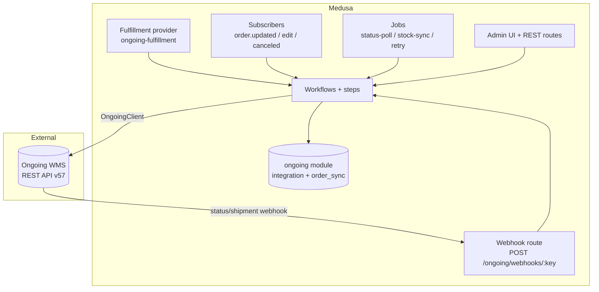
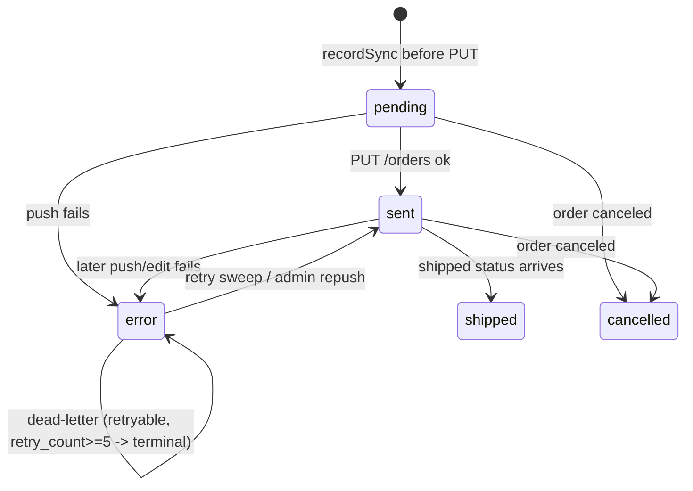
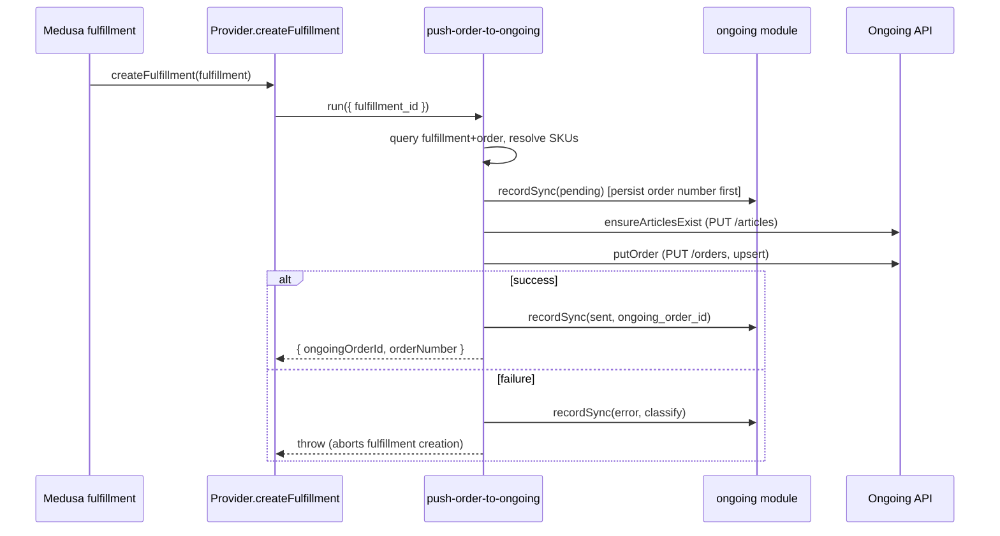

This page explains how the Ongoing Warehouse plugin is built: its module and data models, the Ongoing REST client stack, the workflows and steps that drive every mutation, the subscribers, jobs, links, API routes, fulfillment provider, and admin UI — and how those pieces cooperate across the order, shipment, inventory, edit, cancellation, and retry lifecycles. Read it before changing runtime behaviour. For per-option reference, see the User pages; for the rules you must follow when editing this code, see [[Dev Medusa Rules]].

## Runtime picture at a glance

The plugin fulfils Medusa orders through Ongoing and syncs stock back. Ongoing is the system of record for warehouse stock and shipping; Medusa pushes orders and pulls back fulfilment, tracking, and inventory levels.

Every order-path mutation goes through a workflow; workflows own the Ongoing API calls and the sync-state writes. The module persists integration config and a per-fulfilment sync-state ledger.

## The `ongoing` module

Source: [`src/modules/ongoing/`](https://github.com/Comfyballs/MedusaOngoingWarehousePlugin/blob/main/src/modules/ongoing). Module name `ongoing` (`ONGOING_MODULE`), exported via `Module(ONGOING_MODULE, { service: OngoingModuleService, loaders: [validateOptionsLoader] })`. The service extends `MedusaService({ OngoingIntegration, OngoingOrderSync })`, so standard CRUD (`listOngoingIntegrations`, `updateOngoingOrderSyncs`, and so on) is generated automatically.

### Data model: OngoingIntegration

Table `ongoing_integration`. One row per warehouse integration: one Ongoing goods owner bound to one Medusa stock location.

| Field | Type | Meaning |
|---|---|---|
| `credential_key` | text, unique | Key into the plugin-options `integrations` array. Credentials themselves never live in the DB. |
| `enabled` | boolean | Master switch; disabled integrations are skipped by jobs and by `getIntegrationByLocation`. |
| `stock_location_id` | text, unique | The Medusa stock location this warehouse serves. Immutable after creation. |
| `stock_sync_enabled` | boolean | Gates the stock-sync job for this integration. |
| `stock_sync_interval` / `status_poll_interval` | text, nullable | Per-integration intervals in ms; null falls back to the plugin-option defaults (600000 / 60000). |
| `stock_reconcile_mode` | enum | `sellable_plus_reserved` (default), `precise`, or `onhand`. Controls how Ongoing quantities map to Medusa `stocked_quantity`. |
| `edit_sync_rules` | json, nullable | Per-category rules gating which order edits may re-push at which Ongoing status codes. |
| `shipped_status_codes` | json, nullable | Ongoing status codes treated as "shipped". |
| `cancellable_status_codes` | json, nullable | Ongoing status codes at which a cancel toward Ongoing is allowed. |
| `last_stock_delta_cursor` | text, nullable | ISO timestamp passed as `stockInfoChangedFrom` next tick; advanced only on success; null forces a full sweep. |
| `last_full_stock_sync_at` | dateTime, nullable | Drives the 6-hour full-reconciliation fallback so missed deltas self-heal. |
| `sync_lock_until` | dateTime, nullable | Advisory lock TTL for the status-poll job. |
| `stock_sync_lock_until` | dateTime, nullable | Advisory lock TTL for the stock-sync job — independent of `sync_lock_until` so the two jobs never block each other (bead `mjy`). |

Bookkeeping columns (`last_stock_sync_at`, `last_status_poll_at`) record the last tick.

### Data model: OngoingOrderSync

Table `ongoing_order_sync`. One row per `(order, fulfillment)` pushed to Ongoing — the sync-state ledger.

Key fields: `ongoing_order_number` (unique, deterministic idempotency key `<display_id>-<fulfillment_id>`, persisted before the PUT so a crash never orphans an Ongoing order), `ongoing_order_id` (Ongoing's internal id, returned by `PUT /orders`), `sync_state`, `error_class`, `retry_count`, `shipped_at` (shipment idempotency marker), and the `edit_blocked_*` trio (when and why an order edit was blocked from re-syncing).

`integration_id` is a plain text column (FK by convention, no relationship).

### Sync-state machine

The `error_class` (`retryable` | `terminal`) decides whether the retry job touches a row. Rows stuck in `pending` whose workflow died are flagged back to `error(retryable)` by the orphan-repair workflow so the normal sweep picks them up.

### Service methods worth knowing

- `getClient(credentialKey)` returns a **cached** `OngoingClient` per credential key — one client means one `Throttle` governs all process-wide concurrency toward a goods owner.
- `getCredentials(credentialKey)` is a synchronous in-memory lookup into plugin options (deliberately sync, with an eslint-disable).
- `getIntegrationByLocation(stockLocationId)` returns the first **enabled** integration for a location.
- `recordSync(input)` upserts an `OngoingOrderSync` row keyed on `ongoing_order_number`.
- `acquireSyncLock(integrationId, ttlMs, lockName?)` / `releaseSyncLock(integrationId, lockName?)` implement the advisory lock. `lockName` is `"status_poll"` (default, `sync_lock_until` column) or `"stock_sync"` (`stock_sync_lock_until` column) — independent per job so status-poll and stock-sync never block each other. Acquisition is a **CAS-guarded native UPDATE** (`UPDATE ... WHERE id=? AND <column>=<observed value>`), the same pattern as `attemptRetrySyncTransition`, so two instances can't both win the same lock (bead `mjy`).
- `attemptRetrySyncTransition(input)` is a **CAS-guarded native UPDATE** (`UPDATE ... WHERE id=? AND sync_state='error' AND retry_count=<expected>`) that returns true only if exactly one row changed. It deliberately bypasses last-write-wins CRUD so two ticks can't double-retry a row.

### Plugin options and boot validation

`OngoingPluginOptions`: `integrations: OngoingCredentials[]` (each `{ key, baseUrl, username, password, goodsOwnerId, webhookSecret? }`), plus optional `defaultStockSyncInterval`, `defaultStatusPollInterval`, and `rateLimitConcurrency` (Throttle concurrency per goods owner, default 1). The `validate-options` loader runs the same validation at module boot and logs the validated integration count, so misconfiguration fails app startup rather than first use.

### Migrations

Four migrations under [`src/modules/ongoing/migrations/`](https://github.com/Comfyballs/MedusaOngoingWarehousePlugin/blob/main/src/modules/ongoing/migrations): the base tables and indexes, the `edit_blocked_*` columns, the delta-stock-sync columns, and the `stock_sync_lock_until` column (bead `mjy`). See [[Dev Gotchas]] for the `plugin:db:generate` recipe when you change a model.

## Ongoing REST client stack

Source: [`src/lib/ongoing/`](https://github.com/Comfyballs/MedusaOngoingWarehousePlugin/blob/main/src/lib/ongoing). The barrel `index.ts` re-exports a curated surface (`OngoingClient`, error helpers, `Throttle`, `mapOrderToPostOrderModel`, `mapReturnOrderToPostReturnOrderModel`, `resolveArticleNumber`, `buildOngoingOrderNumber`, `buildOngoingReturnOrderNumber`, retry policy, `ONGOING_EVENTS`, and the types). Internal-only modules (`http-transport`, `way-of-delivery`, `ensure-articles`, `order-change-burst`, `re-query-fulfillment-order`, `re-query-return-fulfillment`, `schemas`, `db-errors`, `emit-domain-event`) are imported by relative path.

### OngoingClient

- **Auth**: HTTP Basic, header computed once in the constructor from `username:password`.
- **Options**: `concurrency` (default 1), `maxRetries` (default 3), `timeoutMs` (default 30000), an injectable `fetchImpl` (default `nodeHttpsFetch`), and an injectable `sleep` for tests.
- **Request pipeline**: `request<T>` wraps each attempt in `throttle.run(...)`; on failure, `classifyError` decides retryable, backoff uses the `Retry-After` header when present else `250 * 2^attempt` ms, and terminal or exhausted attempts rethrow. `doFetch` sets an `AbortController` timeout, turns non-2xx into `OngoingApiError`, and treats a 2xx without JSON content-type (or with unparseable JSON) as a **terminal** `unexpected_body_shape` error — this guards against HTML-on-200 WAF proxies.
- **Methods**: `getOrderStatuses`, `getInventory(articleNumbers?, changedSince?)`, `getOrdersByStatus(from, to)`, `putArticle`, `putOrder` (throws a **retryable** error if a 2xx body lacks a numeric `orderId`), `cancelOrder`, `getOrder(ongoingOrderId)` (`GET /orders/{id}`, used to resolve a return order line's `orderLineId`), `putReturnOrder` (`PUT /returnOrders`, throws **retryable** if a 2xx body lacks a numeric `returnOrderId` — mirrors `putOrder`'s guard), and `testConnection` (used only by tests).
- **Pagination**: private `paginateByCursor` implements ID-cursor pagination per the Ongoing spec (page size 50, stop on empty/short page, `maxId+1` cursor, infinite-loop guard).

### Transport: why node http/https, not fetch

Source: [`http-transport.ts`](https://github.com/Comfyballs/MedusaOngoingWarehousePlugin/blob/main/src/lib/ongoing/http-transport.ts). Ongoing's API (IIS plus a WAF) returns a `500 {"Message":"An error has occurred."}` on **every** call made through Node's global `fetch` (undici high-level), while curl, node `https`, and undici low-level `request()` all succeed with identical headers — verified live (bead `9sp`, commit `4965f28`). `nodeHttpsFetch` is a `typeof fetch`-compatible adapter over `http`/`https.request`: it sets explicit `content-length` (no chunked PUT), forwards `init.signal` so the client's abort-timeout works, flattens array headers, and maps zero-length bodies to `null` for 204/205/304. Timeout handling stays entirely in the client.

### Throttle

Source: [`throttle.ts`](https://github.com/Comfyballs/MedusaOngoingWarehousePlugin/blob/main/src/lib/ongoing/throttle.ts). A counting semaphore with a FIFO wait queue. Per-credential-key scoping happens one layer up in `getClient`, which caches one client — and therefore one throttle — per credential key. This matches Ongoing's guidance to serialize calls per goods owner (see the [parallel-requests](https://developer.ongoingwarehouse.com/parallel-requests) note).

### Error taxonomy

Source: [`errors.ts`](https://github.com/Comfyballs/MedusaOngoingWarehousePlugin/blob/main/src/lib/ongoing/errors.ts). One class, `OngoingApiError`, carries `status`, `kind` (`retryable` | `terminal`), `retryAfterMs`, `body`, and `reason`. Classification:

- `classifyHttpStatus`: 429 or >=500 is retryable; other 4xx is terminal.
- `classifyError`: an `OngoingApiError` keeps its own kind; **anything else is retryable** (network errors — ECONNRESET, DNS, timeout, abort — are deliberately retryable).
- Domain throws from the order mapper and article resolver are always **terminal** (they are data-quality problems).
- Schema and content-type failures are terminal `unexpected_body_shape`; the one exception is a 2xx PUT without an `orderId`, which is retryable.

### Two retry layers

Do not confuse them. The **client** retries a single HTTP call (base 250 ms). The **workflow** retry policy ([`retry-policy.ts`](https://github.com/Comfyballs/MedusaOngoingWarehousePlugin/blob/main/src/lib/ongoing/retry-policy.ts)) counts separate driver passes over a persisted sync row: `MAX_SYNC_RETRIES = 5`, backoff `min(60min, 5min * 2^retry_count)` (5, 10, 20, 40, 60 min). `resolveRetryOutcome` is pure: terminal rows stay dead-lettered; otherwise increment the count and flip to terminal once the cap is reached.

### Order mapping and article resolution

- [`order-mapper.ts`](https://github.com/Comfyballs/MedusaOngoingWarehousePlugin/blob/main/src/lib/ongoing/order-mapper.ts): `mapOrderToPostOrderModel` is pure and every failure throws a **terminal** `OngoingApiError`. It builds `orderNumber`, `deliveryDate` (required, no default), `consignee` from the shipping address, and `orderLines`. When a line carries `unit_price` it is mapped **as-is — no ×100**, per Medusa's price rule (see [[Dev Medusa Rules]]). `weight`/`unit_price` are resolved by [`query-fulfillment-order.ts`](https://github.com/Comfyballs/MedusaOngoingWarehousePlugin/blob/main/src/workflows/steps/query-fulfillment-order.ts) (bead `dl3`): `re-query-fulfillment-order.ts` fetches `order.items.unit_price` (same-module, Order) and `order.items.variant.weight` (cross-module join into Product), keyed by order line item id; `query-fulfillment-order.ts` matches each fulfillment item back to its order line via `line_item_id` and attaches `weight`/`unit_price` to `ResolvedLine`, falling back to `null` when a line has no match. Per-line `currency_code` is intentionally left unset — the mapper falls back to the order-level `currency_code`.
- [`ensure-articles.ts`](https://github.com/Comfyballs/MedusaOngoingWarehousePlugin/blob/main/src/lib/ongoing/ensure-articles.ts): `ensureArticlesExist` is Ongoing webshop-flow step 1 — it upserts each unique articleNumber via `putArticle` **sequentially**, and runs before every order PUT (push and edit).
- [`resolve-article-number.ts`](https://github.com/Comfyballs/MedusaOngoingWarehousePlugin/blob/main/src/lib/ongoing/resolve-article-number.ts): the Ongoing articleNumber **is** the Medusa SKU verbatim. The function only validates uniqueness by querying `product_variant` by SKU (0 or >1 matches is terminal).

### Return order mapping

- [`return-order-mapper.ts`](https://github.com/Comfyballs/MedusaOngoingWarehousePlugin/blob/main/src/lib/ongoing/return-order-mapper.ts): `mapReturnOrderToPostReturnOrderModel` is pure and every failure throws a **terminal** `OngoingApiError`, mirroring `order-mapper.ts`. It builds `returnOrderNumber`, `customerOrder.orderId` (the ORIGINAL Ongoing order id), `inDate` (date-only, e.g. `"2026-07-17"` — **not** a full ISO datetime like `PostOrderModel.deliveryDate`), and `returnOrderLines`. Each return line's `customerOrderLine.orderLineId` is resolved by matching the return line's articleNumber against the original order's Ongoing order lines (fetched via `OngoingClient.getOrder`); each original line is consumed at most once so duplicate article numbers on the original order map to distinct lines.
- The `PostReturnOrderModel` shape (`goodsOwnerId`, `returnOrderNumber`, `customerOrder.orderId`, `inDate`, `comment?`, `returnOrderLines[]`) is confirmed against the official [Ongoing REST API Example Requests](https://github.com/OngoingWarehouse/Ongoing-Warehouse-REST-API-Example-Requests) Postman collection ("Return orders" > "Create or update a return order"), **not** the live `openapi.json` — the spec site was in maintenance when this was built. The `PUT /returnOrders` response's id field name (`returnOrderId`) is inferred by analogy with `putOrder`'s `orderId` and is **unverified**; confirm both against a live Ongoing sandbox before depending on them in production (see [[Dev Testing]] `test:live`).

### Way-of-delivery and order-change burst

- [`way-of-delivery.ts`](https://github.com/Comfyballs/MedusaOngoingWarehousePlugin/blob/main/src/lib/ongoing/way-of-delivery.ts) has two validators over `shipping_option.data`: a lenient `extractOngoingCarrier` (runtime, never throws — malformed config just yields no carrier) and a strict `assertValidOngoingCarrierConfig` (config-time, throws `MedusaError`). The asymmetry is intentional: fail at config save, never fail an order push.
- [`order-change-burst.ts`](https://github.com/Comfyballs/MedusaOngoingWarehousePlugin/blob/main/src/lib/ongoing/order-change-burst.ts): Medusa's `updateOrderWorkflow` inserts one `order_change` row per changed field. A naive `take:1` subscriber query would silently drop sibling changes, so `deriveBurstChangedTypes` unions all changed types across rows within a 2-second window of the newest row. The `ADDRESS_CONTACT_DETAIL_TYPES` set (`shipping_address` / `billing_address` / `email`) is verified against Medusa 2.16.0's `updateOrderWorkflow` source; a spurious `"contact"` entry that matched no real detail type was removed.

## Workflows and steps

Source: [`src/workflows/`](https://github.com/Comfyballs/MedusaOngoingWarehousePlugin/blob/main/src/workflows). All order-path mutations go through workflows. Several steps deliberately use **record-then-rethrow** instead of compensation: a throwing invoke hands compensation `undefined`, and the Ongoing PUT is an idempotent upsert keyed on a persisted order number, so forward-recovery/retry is the model, not rollback.

| Workflow | Trigger | What it does |
|---|---|---|
| `push-order-to-ongoing` | provider `createFulfillment` (sync), admin repush, retry job | Query fulfilment+order, resolve SKUs to articleNumbers, map to `PostOrderModel`, `recordSync(pending)` before PUT, `ensureArticlesExist`, `putOrder`, then `sent`/`error`. No compensation. |
| `push-return-order-to-ongoing` | provider `createReturnFulfillment` (sync) | Query the return fulfillment (no `order` relation), resolve the ORIGINAL order + its sent/shipped `OngoingOrderSync` row from one item's `line_item_id`, fetch that order's Ongoing lines (`getOrder`) to resolve `orderLineId` per articleNumber, map to `PostReturnOrderModel`, `putReturnOrder`. No `OngoingOrderSync`-style ledger row (no migration added for this feature) — success/failure is only an `ONGOING_EVENTS.RETURN_ORDER_PUSHED` / `RETURN_ORDER_PUSH_FAILED` emit plus logs. No compensation; a throw here makes Medusa's core `createReturnFulfillment` delete the just-created return fulfillment row. |
| `sync-order-edit-to-ongoing` | edit subscribers | Gate the edit against `edit_sync_rules`, then re-query and re-PUT the **same** order number. Re-gates internally to close a TOCTOU race. |
| `cancel-ongoing-order` | order.canceled subscriber, provider `cancelFulfillment` | Decide against `cancellable_status_codes`, DELETE toward Ongoing (swallowing "already cancelled"), then mark the row `cancelled`. |
| `sync-ongoing-shipment` | status-poll job, webhook | Load the sync row (idempotent via `shipped_at`), run core `createOrderShipmentWorkflow` inside the step with tracking labels, mark `shipped`. |
| `sync-ongoing-inventory` | stock-sync job | Fetch inventory (delta or full), then batch-reconcile `stocked_quantity` per the integration's reconcile mode. |
| `refresh-ongoing-order-status` | status-poll job, webhook status refresh | Route the per-order `latest_status_code`/`latest_status_text` write through the workflow layer (scoped by order number + integration, skipping terminal rows) instead of a direct module-service call. Shared by the poll sweep and the out-of-band webhook path. |
| `retry-ongoing-syncs` | admin bulk-retry | Reset `last_synced_at: null` on eligible `error/retryable` rows so the sweep picks them up. |
| `flag-orphaned-order-syncs` | `POST /admin/ongoing/syncs/repair-orphaned` | Flip `sent`-with-null-`ongoing_order_id` rows to `error/retryable`. Idempotent. |
| `mark-order-sync-edit-blocked` | edit subscribers | Set or clear the `edit_blocked_*` columns. |
| Integration CRUD | admin routes | `create` (compensation deletes the row; step 2 runs `setup-location` as a saga), `update`, `delete` (Medusa-side row only). |
| `setup-ongoing-location` | nested in create, or directly | Provisions the fulfilment set, service zone, shipping option, integration-location write (with compensation), and the stock-location link. |

The push chain in detail:

`setup-ongoing-location` duplicates the provider's identifier and option id into `setup-location/constants.ts` — a documented **must-stay-identical** contract with no compile-time enforcement.

## Subscribers, jobs, links

### Subscribers

Source: [`src/subscribers/`](https://github.com/Comfyballs/MedusaOngoingWarehousePlugin/blob/main/src/subscribers). All three never throw (per-row try/catch plus an outer backstop) and follow **persist-then-emit**: the state-writing workflow runs first, then a domain event is emitted through the isolated `emitDomainEvent` helper, so an event-bus outage can never be mislogged as a failed workflow.

- `order-canceled.ts` runs `cancelOngoingOrderWorkflow` per sync row and emits `ORDER_CANCELLED` when a cancel actually happened.
- `order-edit-confirmed.ts` handles `order-edit.confirmed`, gates line-item edits, and trusts the workflow's own re-gate over its pre-check. The `LINE_ITEM_ACTION_TYPES` set (`ITEM_ADD`/`ITEM_UPDATE`/`ITEM_REMOVE`/`SHIPPING_ADD`/`SHIPPING_UPDATE`/`SHIPPING_REMOVE`) is verified against Medusa 2.16.0's `ChangeActionType` enum; today only `ITEM_ADD`/`ITEM_UPDATE`/`SHIPPING_ADD` actually reach this event, the rest are forward-compatible coverage.
- `order-updated.ts` handles `order.updated`, uses the burst-union logic to detect address/contact/email changes, and gates on the `address_contact` category.

### Jobs

Source: [`src/jobs/`](https://github.com/Comfyballs/MedusaOngoingWarehousePlugin/blob/main/src/jobs). All run every minute.

- `retry-failed-syncs.ts`: lists all `error/retryable` rows globally (no integration lock — safety is row-level CAS only), filters to due rows by backoff, and per row either dead-letters, re-invokes `pushOrderToOngoing`, or loses the CAS silently. A row with a null `medusa_fulfillment_id` is dead-lettered immediately — it cannot be re-pushed — with `retry_count` unchanged and `order_dead_lettered` emitted with a null fulfillment id (see [[Dev Gotchas]]).
- `status-poll.ts`: per enabled integration, acquires its own `"status_poll"` lock, calls `getOrdersByStatus(100, 999)`, refreshes each matched non-terminal row's `latest_status_code/text` via `refreshOngoingOrderStatusWorkflow` (bead `o6c`; the same workflow the webhook status refresh uses), and runs `syncOngoingShipmentWorkflow` when a shipped status appears. The lock/cadence bookkeeping (`acquireSyncLock`/`releaseSyncLock`/`updateOngoingIntegrations` timestamp stamp) stays a direct module-service call — tangled with the advisory-lock `finally` lifecycle rather than a per-order data mutation, so it's left as-is (a documented, lower-priority `arch-workflow-required` deviation).
- `stock-sync.ts`: per enabled-and-stock-sync-enabled integration, acquires its own `"stock_sync"` lock, decides full vs delta (full at least every 6 h), runs `syncOngoingInventoryWorkflow`, and advances the delta cursor **only on success**.

`status-poll` and `stock-sync` each hold an independent advisory lock (`sync_lock_until` / `stock_sync_lock_until`), so if both are due for one integration in the same tick they run concurrently rather than one blocking the other for its TTL (bead `mjy`).

### Links

Source: [`src/links/`](https://github.com/Comfyballs/MedusaOngoingWarehousePlugin/blob/main/src/links). `defineLink` associations: stock-location to integration (`deleteCascade` on the link only), order-sync to fulfilment, and order-sync to order. These preserve module isolation while allowing `query.graph` joins.

## API routes and the webhook

Source: [`src/api/`](https://github.com/Comfyballs/MedusaOngoingWarehousePlugin/blob/main/src/api). All `/admin/ongoing/*` routes use Medusa's default admin auth. The webhook lives in a bare `/ongoing/*` namespace with fully custom auth.

Admin routes cover credential-key listing, integration CRUD (update is `POST` with PATCH semantics — Medusa forbids PUT/PATCH), per-order repush and sync read, the dashboard `syncs` list with a five-state summary, bulk retry, orphan repair (no UI entry point), and `test-connection` (which returns **HTTP 200** even on an Ongoing failure, distinguishing a bad request from a reachable-but-erroring Ongoing).

### Webhook auth and dispatch

`POST /ongoing/webhooks/:credentialKey`. Auth pipeline, in order:

1. Unknown credential key -> uniform **401**.
2. Missing `webhookSecret` in plugin options -> **401**.
3. `X-Auth-Token` compared to `webhookSecret` via `crypto.timingSafeEqual` (static shared secret, not HMAC) -> mismatch **401**.
4. Payload must be an object with numeric `goodsOwnerId` and `orderStatus.number` -> else **400**.
5. Payload `goodsOwnerId` must equal the credential's configured goods owner -> else **401**.

After auth it **always returns 200** — both dispatchers swallow workflow errors and log only, and the whole post-auth body (integration lookup, the nullable `shipped_status_codes` read, dispatch) is wrapped so a transient DB/config error also acks 200 instead of leaking a 500. Ongoing floods retries on any non-2xx and the poll job is the reconciliation backstop; idempotency lives in the workflows. If the status is a `shipped_status_codes` value it dispatches a shipment, otherwise a status refresh. Two visibility warnings log here: a webhook for a credential with **no bound integration**, and an integration with **no `shipped_status_codes` configured** (shipment dispatch can never fire until they are set).

## Fulfillment provider

Source: [`src/providers/ongoing-fulfillment/`](https://github.com/Comfyballs/MedusaOngoingWarehousePlugin/blob/main/src/providers/ongoing-fulfillment). `OngoingFulfillmentProviderService extends AbstractFulfillmentProviderService`. `ONGOING_PROVIDER_ID = "ongoing"`; Medusa derives the runtime provider id as `fp_${identifier}_${config-id}`, so renaming requires migrating existing shipping options.

- `getFulfillmentOptions()` returns a static, global list (standard and return) — it takes no args and cannot vary per warehouse; the real per-warehouse `wayOfDelivery` is resolved later, per order, from the shipping option's `data`.
- `validateOption` / `validateFulfillmentData` accept only the two known option ids and run strict carrier-config validation at shipping-option creation time.
- `canCalculate()` returns `false` (flat rates).
- `createFulfillment` runs `pushOrderToOngoing` **synchronously** — a push failure aborts fulfilment creation — and returns a `data` blob that is the only thing `cancelFulfillment` later receives.
- `cancelFulfillment` reads identifiers from that stashed blob and runs `cancelOngoingOrderWorkflow`. It resolves (never throws) for benign reasons but **must throw** `MedusaError.NOT_ALLOWED` for `status_not_cancellable`, because Medusa core unconditionally sets `canceled_at` on any non-throwing return — throwing is the only way to keep Medusa's fulfilment un-cancelled while Ongoing keeps shipping (bead `#109`).
- `createReturnFulfillment` implements Ongoing return-order creation (previously a no-op stub). Medusa's core `FulfillmentModuleService.createReturnFulfillment` creates the return fulfillment row first, then calls this method with `{ ...fulfillment, shipping_option }` — critically, **no `order`/`order_id`** (the core method destructures `order` out before persisting). So, mirroring `createFulfillment`'s "trust only the id, re-query everything fresh" pattern, this method reads only `fromData.id` and runs `pushReturnOrderToOngoing` **synchronously**; that workflow re-derives the original order (and its already-synced Ongoing order) from one of the return items' `line_item_id`. A push failure aborts return-fulfillment creation the same way an outbound push failure does. There is no `cancelReturnFulfillment` counterpart in Medusa 2.16.0 to read the returned stash back (its compensation TODO falls back to `cancelFulfillment`), so the stash exists for operator visibility only. **Deferred**: return-status handling (Ongoing webhook payloads carry `isReturn` parcels; the shipment mapper already filters them out, but nothing yet reacts to a return actually being received/processed at the warehouse) — tracked as follow-up work, not implemented here.

## Admin UI

Source: [`src/admin/`](https://github.com/Comfyballs/MedusaOngoingWarehousePlugin/blob/main/src/admin). Three surfaces share `lib/sdk.ts` (one JS-SDK client) and `lib/use-ongoing-query.tsx` (a react-query wrapper paired with `QueryStateView` so failed fetches never render as empty states).

- **Ops dashboard** (`/ongoing`): a connection-health panel (badges computed from fetched data, no live test), a five-state summary strip, and a "Failed & pending syncs" DataTable with a bulk Retry command.
- **Settings** (`/settings/ongoing`): create (a FocusModal that warns location assignment runs setup automatically and is permanent), test-connection (which also populates the status-code pickers), edit (with `credential_key` and `stock_location_id` disabled), and delete (which warns only the Medusa-side row is removed).
- **Order widget** (`order.details.side.before`): per sync row shows status, tracking links, an "Edit blocked" banner, and a Re-push/Retry button.

## End-to-end lifecycles

**Order push -> shipment -> tracking**: a fulfilment with the Ongoing shipping option triggers `createFulfillment` -> `pushOrderToOngoing`. Then status-poll and the webhook both keep `latest_status_code` current; once a shipped code arrives, both converge on the idempotent `syncOngoingShipmentWorkflow`, which runs core `createOrderShipmentWorkflow` with tracking labels and marks the row `shipped`.

**Inventory**: every minute `stock-sync` picks due integrations, chooses delta or full, fetches inventory, and reconciles `stocked_quantity` per mode — `sellable_plus_reserved` reconstructs Medusa's `stocked = sellable + reserved` invariant so reservations don't double-deduct; `precise` scopes reserved to this integration's own synced orders; `onhand` uses raw on-hand.

**Edits**: `order-edit.confirmed` maps to the `line_items` category and `order.updated` (via burst-union) to `address_contact`. Each affected row is gated, then either blocked (persist `edit_blocked_*`, emit `EDIT_BLOCKED`) or re-synced by re-PUTting the same order number.

**Cancellation**: `order.canceled` cancels each sync row, attempting even on an unknown status and swallowing an "already cancelled" response, but rethrowing a genuine refusal (for example, already shipped).

**Retry and orphan repair**: failed rows are swept by `retry-failed-syncs` with exponential backoff and dead-lettered at 5 attempts. The dashboard's bulk Retry and the widget's Re-push provide manual paths; `repair-orphaned` fixes `sent`-with-null-id rows; `src/scripts/resync-dropped-address-changes.ts` replays the pre-fix dropped-address-change bug against candidate orders.

## Related pages

- [[Dev Medusa Rules]]
- [[Dev Testing]]
- [[Dev Gotchas]]
- [[Dev Contributing]]
- [[Dev Beads]]
